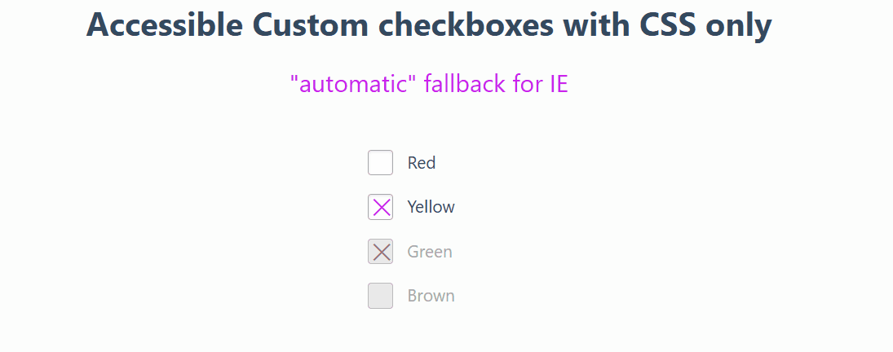

# Custom Checkboxes con CSS

Este proyecto demuestra cómo crear checkboxes personalizados y accesibles utilizando solo CSS. Se incluye una solución de respaldo automática para navegadores antiguos como Internet Explorer.

## Captura de pantalla



## Características

- Diseño accesible y personalizable.
- Sin necesidad de JavaScript.
- Soporte para estados como "checked" y "disabled".
- Compatibilidad con navegadores modernos y fallback automático en IE.

## Estructura del Proyecto

```
/custom-checkboxes
│-- index.html
│-- styles.css
│-- img/
    ├── preview.png
```

## Instalación y Uso

1. Clona el repositorio en tu máquina local:

   ```sh
   git clone https://github.com/tuusuario/custom-checkboxes.git
   ```

2. Abre el archivo `index.html` en tu navegador.

3. Si deseas modificar los estilos, edita el archivo `styles.css`.

## Explicación del Código

### HTML

- Se define una estructura de formulario con varios checkboxes.
- Cada checkbox tiene una etiqueta asociada (`<label>`), lo que mejora la accesibilidad.
- Algunos checkboxes están marcados (`checked`) o deshabilitados (`disabled`).

### CSS

- Se oculta el checkbox nativo y se usa `label:before` para crear una casilla personalizada.
- Se utilizan efectos de transición y `box-shadow` para mejorar la apariencia.
- Se añade soporte para accesibilidad y `focus`.

## Licencia

Este proyecto está bajo la licencia MIT.
